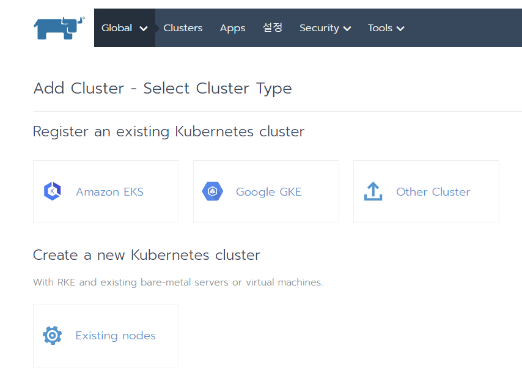
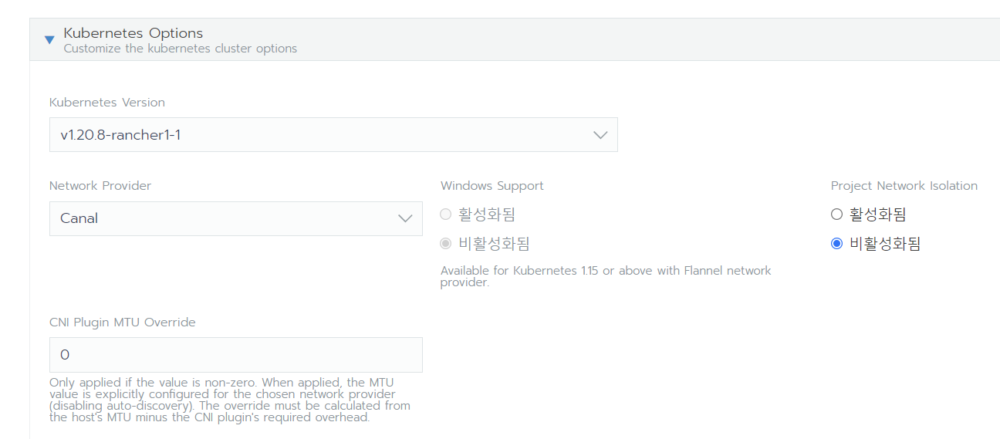
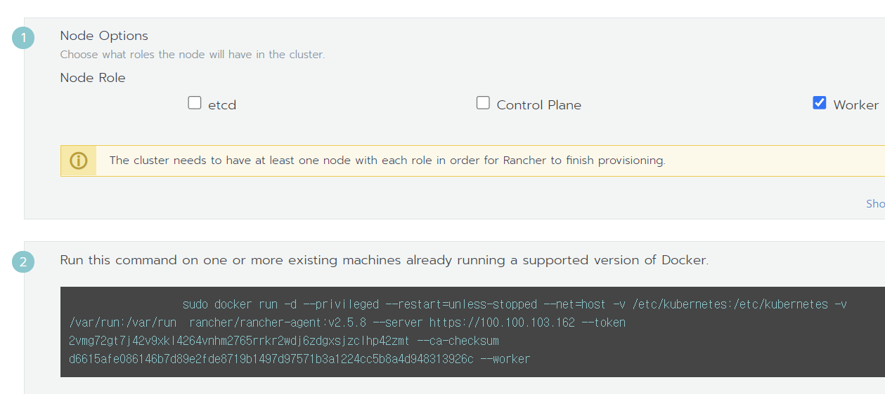

# Docker & Kubernetes 설치 

문서 작성 기준은 아래와 같은 환경에서 설치 하는 방법에 대하여 기술.

- OS : Linux CentOS 7 
- User : root
- etc : yum 을 통한 패키지 설치 


## 점검사항

### 장비 초기화가 되지 않는 상황일 때

1. docker 리소스 삭제

```bash
$ docker rm -f $(docker ps -qa)
$ docker rmi -f $(docker images -q)
$ docker volume rm $(docker volume ls -q)
```

2. unmount

```bash
# mount가 해제가 안될 경우 직접 입력하여 unmount 실행
$ for mount in $(mount | grep tmpfs | grep '/var/lib/kubelet' | awk '{ print $3 }') /var/lib/kubelet /var/lib/rancher; do umount $mount; done
```

3. 설정 삭제

```bash
$ rm -rf /etc/ceph \
         /etc/cni \
         /etc/kubernetes \
         /opt/cni \
         /opt/rke \
         /run/secrets/kubernetes.io \
         /run/calico \
         /run/flannel \
         /var/lib/calico \
         /var/lib/etcd \
         /var/lib/cni \
         /var/lib/kubelet \
         /var/lib/rancher/rke/log \
         /var/log/containers \
         /var/log/kube-audit \
         /var/log/pods \
         /var/run/calico
```

4. docker 서비스 종류

```bash
$ systemctl stop docker
# docker 종료 실패시
$ systemctl stop docker.socket
```

5. ip link 삭제

```bash
$ ip a
# 아래 주석관련된 인터페이스 삭제
# flannel.1
# cni0
# tunl0
# caliXXXXXXXXXXX 
# vethXXXXXXXX 
$ ip link delete interface_name
```

6. iptables 확인

```bash
$ iptables -L -t nat
$ iptables -L -t mangle
$ iptables -L
```

7. 재시작

```bash
$ reboot
```


## 공통 설치

### 리눅스 공통 설정 및 패키지 설치

설치 진행할 전 노드(Control-plain, Worker) 공통 사항이며,  인터넷 연결 가능한 네트워크 설정 및 yum 설정 후 진행 한다.

1. 설치 패키지 업데이트 

```bash
$ yum -y update 
```

2. 의존성 패키지 및 network tool 설치

```bash
$ yum install conntrack -y 
$ yum install socat -y
$ yum install net-tools -y
```

3. 브리지 된 IPv4 트래픽을 iptables 체인으로 전달하기 위해 커널 파라메터 수정

```bash
$ echo 'net.bridge.bridge-nf-call-ip6tables = 1 ' > /etc/sysctl.conf
$ echo 'net.bridge.bridge-nf-call-iptables = 1 ' >> /etc/sysctl.conf
```

수정 후 확인

```bash
$ sysctl -p
net.bridge.bridge-nf-call-ip6tables = 1
net.bridge.bridge-nf-call-iptables = 1
```

확인시 다음 오류 났을때 대처 방법
```bash
$ sysctl -p
sysctl: cannot stat /proc/sys/net/bridge/bridge-nf-call-ip6tables: 그런 파일이나 디렉터리가 없습니다
sysctl: cannot stat /proc/sys/net/bridge/bridge-nf-call-iptables: 그런 파일이나 디렉터리가 없습니다

$ modprobe br_netfilter
$ lsmod | grep br_netfilter
$ sysctl -p
net.bridge.bridge-nf-call-ip6tables = 1
net.bridge.bridge-nf-call-iptables = 1
```

4. 리눅스 swap 설정 해제

```bash
$ swapoff -a
# /etc/fstab 파일에서 "/dev/mapper/centos-swap swap" 설정 주석 처리
$ sed -i '/swap/s/^/#/g' /etc/fstab
```

5. SELinux 설정 변경

```bash
$ setenforce 0
# /etc/selinux/config 파일에서 SELINUX 값을 permissive 로 변경 
$ sed -i 's/^SELINUX=enforcing$/SELINUX=permissive/' /etc/selinux/config
```

6. 방화벽 해제

```bash
$ systemctl stop firewalld
$ systemctl disable firewalld
```

### Docker 설치 및 노드 공통 설정 

1. Docker  설치를 위한 의존성 패키지 설치 

```bash
$ yum install yum-utils device-mapper-persistent-data lvm2 -y
```

2. Docker 저장소 추가

```bash
$ yum-config-manager --add-repo https://download.docker.com/linux/centos/docker-ce.repo
```

3. Docker 필요 패키지 설치

```bash
$ vi /etc/yum.repos.d/docker-ce.repo
# 아래내용추가
[centos-extras]
name=Centos extras - $basearch
baseurl=http://mirror.centos.org/centos/7/extras/x86_64
enabled=1
gpgcheck=0

# 추가 후 yum 설치
$ yum -y install slirp4netns fuse-overlayfs container-selinux
```

3. DockerCE 최신 버전 성치 

```bash
$ yum install docker-ce -y
```

4. 설치 완료 후 Docker 실행 및 확인

```bash
# docker 실행 
$ systemctl start docker

# docker 실행 확인
systemctl status docker
● docker.service - Docker Application Container Engine
   Loaded: loaded (/usr/lib/systemd/system/docker.service; disabled; vendor preset: disabled)
   Active: active (running) since 금 2021-07-09 09:47:19 KST; 5s ago
     Docs: https://docs.docker.com
 Main PID: 5253 (dockerd)
    Tasks: 13
   Memory: 44.7M
   CGroup: /system.slice/docker.service
           └─5253 /usr/bin/dockerd -H fd:// --containerd=/run/containerd/containerd.sock

# 부팅시 Docker 자동 실행 설정 
$ systemctl enable docker

# docker 동작 확인 (skip 하여도 상관 없음)
$ docker container run hello-world
```

## Rancher 설치 시

1. rancher UI 실행

```bash
# Docker container 실행
$ docker run -d --restart=unless-stopped -p 80:80 -p 443:443 --privileged rancher/rancher:latest 
# 1. docker 버전은 Rancher를 지원하는 버전이여야 한다.
# 2. --privileged 옵션을 통하여 container에서 system 설정을 변경할 수 있어야 한다.
```

2. rancher UI 접속

    

    UI에 아이디와 패스워드를 설정 후에 "Add Cluster"를 클릭 후 Existing nodes를 클릭한다.

3.  Cluster 설정

    

    네트워크 및 기타 설정을 완료 한다.

4. 노드추가

    

​    어떤 노드로 사용할지에 대한 설정 후 아래 Command를 복사 후 생성 노드에서 실행한다. 대략 5 ~ 10분 후 클러스터 설정이 완료된다.

## Kubeadm으로 설치 시

1. Kubernetes(이하 k8s) yum 저장소 추가 

```bash
# /etc/yum.repos.d/kubernetes.repo 파일 생성
$ cat <<EOF > /etc/yum.repos.d/kubernetes.repo[kubernetes]name=Kubernetesbaseurl=https://packages.cloud.google.com/yum/repos/kubernetes-el7-x86_64enabled=1gpgcheck=1repo_gpgcheck=1gpgkey=https://packages.cloud.google.com/yum/doc/yum-key.gpg https://packages.cloud.google.com/yum/doc/rpm-package-key.gpgEOF
```

2. k8s 설치

```bash
$ yum install -y kubelet kubeadm kubectl --disablerepo=\* --enablerepo=kubernetes --disableexcludes=kubernetes
```

3. k8s 시작 및 설정

```bash
# k8s 시작 
$ systemctl start kubelet

# k8s 상태 확인 
$ systemctl status kubelet
● kubelet.service - kubelet: 
The Kubernetes Node Agent   Loaded: loaded (/usr/lib/systemd/system/kubelet.service; 
enabled; 
vendor preset: disabled)  Drop-In: /usr/lib/systemd/system/kubelet.service.d
└─10-kubeadm.conf   Active: active (running) since 월 2021-06-07 08:16:30 KST; 5h 53min ago     Docs: https://kubernetes.io/docs/ Main PID: 1008 (kubelet)    Tasks: 15   Memory: 143.0M   CGroup: /system.slice/kubelet.service           └─1008 /usr/bin/kubelet --bootstrap-kubeconfig=/etc/kubernetes/bootstrap-
...

# k8s 부팅시 자동 시작 등록
$ systemctl enable kubelet
```

### Control-plain 노드 설정

1. kubeadm 사용을 위한 Linux 환경설정 추가 

```bash
$ echo '1' > /proc/sys/net/bridge/bridge-nf-call-iptables$> echo '1' > /proc/sys/net/ipv4/ip_forward
```

2. 사용 유저 환경설정 내 KUBECONFIG 추가 

```bash
$ echo 'export KUBECONFIG=/etc/kubernetes/admin.conf' >> ~/.bashrc
```

3. Control-plain 노드 초기화 

```bash
# --apiserver-advertise-address 항목에 Control-plain 노드 IP 입력 $> kubeadm init --pod-network-cidr=10.244.0.0/16 --apiserver-advertise-address=IP-ADDR
# 아래와 같은 결과가 나오면 성공 
...Your Kubernetes control-plane has initialized successfully!To start using your cluster, you need to run the following as a regular user:  mkdir -p $HOME/.kube  sudo cp -i /etc/kubernetes/admin.conf $HOME/.kube/config  sudo chown $(id -u):$(id -g) $HOME/.kube/configYou should now deploy a pod network to the cluster.Run "kubectl apply -f [podnetwork].yaml" with one of the options listed at:  <https://kubernetes.io/docs/concepts/cluster-administration/addons/>Then you can join any number of worker nodes by running the following on each as root:
# 아래는 Worker 노드 에서 실행할 Join 명령이므로 복사 해 둔다. 
kubeadm join control-plain-ip:6443 --token fnbiji.5wob1hu12wdtnmyr \    --discovery-token-ca-cert-hash sha256:701d4da5cbf67347595e0653b31a7f6625a130de72ad8881a108093afd06188b    ...
```

4. Container Network Interface (이하 CNI) 설치 (flannel 기준)

```bash
$ kubectl apply -f https://raw.githubusercontent.com/coreos/flannel/2140ac876ef134e0ed5af15c65e414cf26827915/Documentation/kube-flannel.yml# ifconfig 명령으로 CNI 인터페이스 확인 (설치 후 시간이 좀 걸림)
$ ifconfigcni0: flags=4163<UP,BROADCAST,RUNNING,MULTICAST>  mtu 1450        inet 10.244.0.1  netmask 255.255.255.0  broadcast 10.244.0.255        inet6 fe80::c8e4:c7ff:fe83:5731  prefixlen 64  scopeid 0x20<link>        ether ca:e4:c7:83:57:31  txqueuelen 1000  (Ethernet)        RX packets 46420  bytes 3739824 (3.5 MiB)        RX errors 0  dropped 0  overruns 0  frame 0        TX packets 47115  bytes 4308779 (4.1 MiB)        TX errors 0  dropped 0 overruns 0  carrier 0  collisions 0docker0: flags=4099<UP,BROADCAST,MULTICAST>  mtu 1500        inet 172.17.0.1  netmask 255.255.0.0  broadcast 172.17.255.255        ether 02:42:55:61:ed:b1  txqueuelen 0  (Ethernet)        RX packets 0  bytes 0 (0.0 B)        RX errors 0  dropped 0  overruns 0  frame 0        TX packets 0  bytes 0 (0.0 B)        TX errors 0  dropped 0 overruns 0  carrier 0  collisions 0        ...
```

### Worker 노드 설정

1. Control-plain 노드로 Join 실행 

```bash
$ kubeadm join control-plain 노드 IP:6443 --token q2l6jr.wev7kir18mr2kv32 \	--discovery-token-ca-cert-hash sha256:5b1fa9b80640e361b97b1915988ec44b0c82ba76695d5587e4f0bda42c1af10e# 실행 후 Control-plain 노드 에서 Worker 노드 상태 확인 	
$ kubectl get nodes	NAME           STATUS   ROLES                  AGE     VERSION  k8s-master     Ready    control-plane,master   3d21h   v1.21.1  k8s-worker-1   Ready    <none>                 3d20h   v1.21.1
```

## kubectl 설치

1. 랜쳐 접속 > Cluster 탭으로 이동
2. `Kubeconfig File` 버튼 클릭
3. `mkdir ~/.kube/`
4. `vi config`
5. 팝업에 나타난 내용 복사 후 `config` 파일에 붙여넣기
6. `download` 클릭 (https://kubernetes.io/docs/tasks/tools/) > `Install kubectl on Linux` 클릭
7. 메뉴얼 대로 설정
```bash
# 1. Download the latest release with the command:
$ curl -LO "https://dl.k8s.io/release/$(curl -L -s https://dl.k8s.io/release/stable.txt)/bin/linux/amd64/kubectl"

# 2. Validate the binary (optional)
# 2.1. Download the kubectl checksum file:
$ curl -LO "https://dl.k8s.io/$(curl -L -s https://dl.k8s.io/release/stable.txt)/bin/linux/amd64/kubectl.sha256"
# 2.2. Validate the kubectl binary against the checksum file:
$ echo "$(<kubectl.sha256) kubectl" | sha256sum --check

# 3. Install kubectl
$ sudo install -o root -g root -m 0755 kubectl /usr/local/bin/kubectl

# 4. Test to ensure the version you installed is up-to-date:
$ kubectl version --client
```

## 옵션 및 Tip

1. k8s 명령어 alias , 자동완성 추가

```bash
# yum 설치
$ yum install bash-completion -y
$ source /usr/share/bash-completion/bash_completion

# 설정
$ echo 'source <(kubectl completion bash)' >>~/.bashrc
$ kubectl completion bash >/etc/bash_completion.d/kubectl
$ echo 'alias k=kubectl' >>~/.bashrc
$ echo 'complete -F __start_kubectl k' >>~/.bashrc

# 적용
$ source ~/.bashrc
```

관련 내용은 k8s 공식 문서 참조. https://kubernetes.io/ko/docs/tasks/tools/included/optional-kubectl-configs-bash-linux/ 

2. x-window 설치
    Control-plain 노드 내 Web Dash 보드 사용시 필요. 

```bash
$ yum groupinstall "GNOME Desktop" -y# 설치 후 시작$> startx
```

3. Control-plain 노드 내 Web Dash 보드 설치

```bash
$ kubectl apply -f https://raw.githubusercontent.com/kubernetes/dashboard/v2.0.0-beta8/aio/deploy/recommended.yaml

# k8s proxy 실행 (필요시 백그라운드로 실행)
$ kubectl proxy

# Control-plain 노드 브라우저에서 아래 주소 접속 
http://localhost:8001/api/v1/namespaces/kube-/services/https:kubernetes-dashboard:/proxy/
```

4. Control-plain 노드 Join Token 재생성 

kubeadm 의 init 명령으로 생성된 join 명령어내 token의 만료시간은 24시간이다. 따라서 k8s 설치 24시간 이후 Worker노드를 Join 해야하는 경우 신규 Token을 생성해야한다.

```bash
# Contorol-plain 노드에서 아래 명령으로 현재 발급된 token을 조회한다. 결과가 없다면 token이 없는것이다.
$ kubeadm token list

# 신규 token을 발급한다. join 명령 시 --token 의 값으로 사용
$ kubeadm token create
$ kubeadm token list
TOKEN                     TTL         EXPIRES                     ... 
hbl3p4.fdequklgie31otjm   17h         2021-06-08T08:38:15+09:00   ...

# k8s Control-plain노드의 인증서 값을 가져온다. join 시  --discovery-token-ca-cert-hash 파라메터로 사용
$ openssl x509 -pubkey -in /etc/kubernetes/pki/ca.crt | openssl rsa -pubin -outform der 2>/dev/null | openssl dgst -sha256 -hex | sed 's/^.* //'5b1fa9b80640e361b97b1915988ec44b0c82ba76695d5587e4f0bda42c1af10e

# 위 두 값을 조합하여 Worker 노드에서 join 명령을 실행한다.
$ kubeadm join control-plain-ip:6443 --token hbl3p4.fdequklgie31otjm \	
--discovery-token-ca-cert-hash sha256:5b1fa9b80640e361b97b1915988ec44b0c82ba76695d5587e4f0bda42c1af10e

# Control-plain 노드에서 join 상태를 확인한다.
$ kubectl get nodes
NAME           STATUS   ROLES                  AGE     VERSION
k8s-master     Ready    control-plane,master   3d22h   v1.21.1
k8s-worker-1   Ready    <none>                 3d21h   v1.21.1
k8s-worker-2   Ready    <none>                 3d18h   v1.21.1s
```
